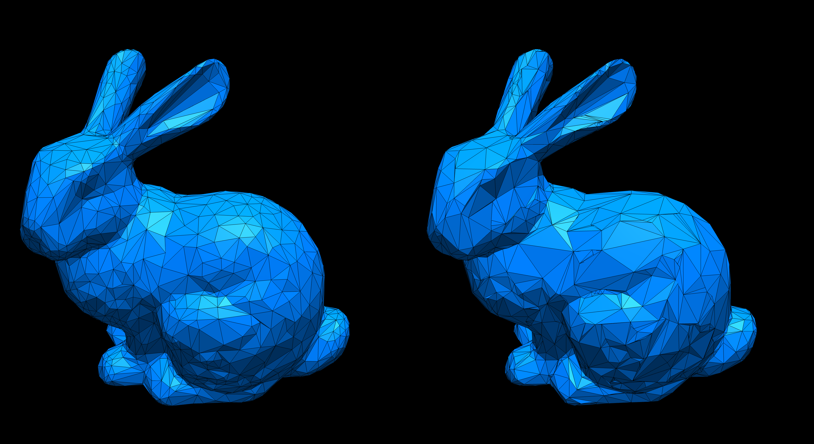
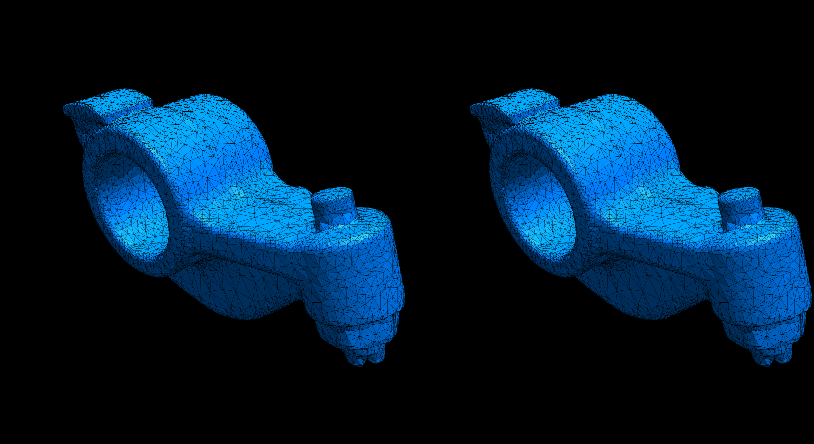

# Homework 5: Quadric Error Metric Simplification

**Task 1. Use the provided code template to implement the QSim algorithm (see `halfedge.ts` and `primitive.ts`).**

Here are example outputs:

|ReductionRatio|`r=0.0`|`r=0.50`|`t=0.90`|`t=0.95`|
|:--:|:--:|:--:|:--:|:--:|
|Bunny|||||
|Rocket ARM|||||

- Left: Simplified using Qsim (QEM)
- Right: Simplified using `SimplifyModifier` (from three.js)

**Task 2. Answer questions regarding the implementation.**

**Implementation complexity**: Which code snippet (report in line numbers) in the `geometry/primitive.ts` or `geometry/halfedge.ts` is the most time consuming for you to implement? Explain your coding experience and encountered challenges briefly.

```
The most time consuming was by far the edge collapse (lines 348 onward, halfedge.js). 
As a good edge collapse algorithm was crucial for testing the rest, it was especially annoying.
Debugging the collapsing was slow and excruciating, as the program often ended up in an infinity loop, running out of memory.
Improving the error calculation and edge selection merely made spotting mistakes in the edge collapse harder.
```

**Debugging complexity**: Describe an impressive bug that you wrote while implementing this project, and briefly explain how you fixed it.

```
No 'impressive' bugs, as most of them were just infinity loops or thrown errors caused by one of my asserts.
I had to rewrite the edge collapse algorithm multiple times to get it to work.
```

**Runtime performance**: Which part of your code could be a bottleneck and how the computation performance could be improved?

```
As mentioned in the paper, the quadrics should probably have been stored, as they are calculated multiple times right now, which is expensive.
The edge collapse also performs some unncesseary calculations.
```

## Submission Instruction

In short: Send a [pull request](https://github.com/mimuc/gp/pulls).

To submit a solution, one should create a folder named by the corresponding GitHub username in the `homeworks` folder and that folder will serve for all future submissions.

For example, in the `homeworks` folder, there is an existing folder `changkun`
that demonstrates how to organize submissions:

```
gp
├── README.md               <-- Top level README
├── 5-remesh                <-- Project skeleton
└── homeworks
    └── changkun            <-- GitHub username
        └── 3-smooth        <-- Actual submission
```
